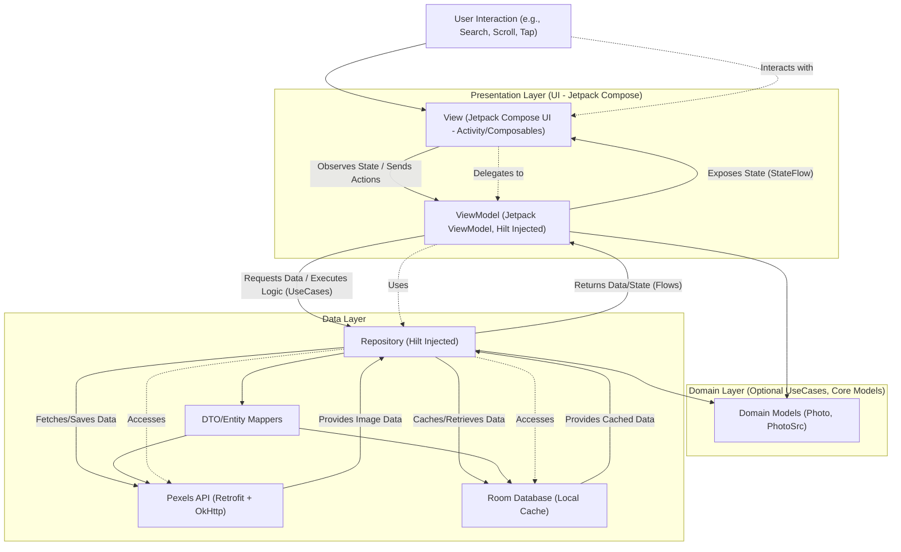

# PexelsSample Architecture Document

## 1\. Technical Summary

PexelsSample is a native Android application built using Kotlin `2.0.21` and Jetpack Compose (BOM `2024.09.00`), designed to provide users with a seamless experience for searching and Browse high-quality images via the Pexels API. The architecture follows the Model-View-ViewModel (MVVM) pattern to ensure a clear separation of concerns, enhance testability, and promote a scalable codebase. Key Jetpack libraries such as ViewModel, Navigation Component, Room (for local caching of photo metadata), and Hilt (for dependency injection) are utilized. The application focuses on efficient image loading with Coil, robust error handling, and clear communication of loading and empty states, aiming for a production-quality standard as outlined in the PRD. Target SDK is `35` and Min SDK is `26`. [3, 5, 10, 27, 54, 55, 59, 61]

## 2\. High-Level Overview

The application architecture is centered around the MVVM pattern. The UI (View) is built with Jetpack Compose Composables, observing data and state exposed by ViewModels. ViewModels interact with Repositories to fetch and manage data from the Pexels API and a local Room database cache. User interactions trigger actions in the ViewModel, which updates its state and potentially fetches new data via the Repository. The Repository layer abstracts data source logic. Kotlin Coroutines and Flow are used for asynchronous operations and reactive data streams. Hilt manages dependencies.

The primary user interaction flow:

1.  User inputs a search query or views curated photos.
2.  The Composable UI (View) sends this action to the `SearchViewModel`.
3.  The `SearchViewModel` requests data from the `ImageRepository`.
4.  The `ImageRepository` fetches image data from the Pexels API (and caches/retrieves metadata via Room).
5.  The `SearchViewModel` updates its state (e.g., list of photos, loading/error status) exposed via `StateFlow`.
6.  The UI recomposes to display the images or state changes.
7.  User can tap an image to navigate to a detail view.

<!-- end list -->

## 3\. Component View

The application is structured into Presentation (UI and ViewModel), Domain (core models and optional use cases), and Data (repositories, data sources, mappers) layers.

```mermaid
graph TD
    subgraph "User Interface (View - ui package)"
        Screen_Home["HomeScreen"]
        Screen_SearchResults["SearchResultsScreen"]
        Screen_ImageDetail["ImageDetailScreen"]
        Composable_ImageItem["ImageItem (Reusable)"]
        Composable_SearchBar["SearchBar (Reusable)"]
        Composable_ErrorView["ErrorView (Reusable)"]
        Composable_LoadingIndicator["LoadingIndicator (Reusable)"]
    end

    subgraph "Presentation Logic (ViewModel - ui package)"
        VM_Search["SearchViewModel"]
        %% VM_ImageDetail (Optional)
    end

    subgraph "Domain Layer (domain package)"
        Model_Photo["Photo (Domain Model)"]
        Model_PhotoSrc["PhotoSrc (Domain Model)"]
        Interface_ImageRepo["ImageRepository (Interface)"]
        UseCase_Search["SearchPhotosUseCase (Optional)"]
    end

    subgraph "Data Layer (data package)"
        Repo_ImageImpl["ImageRepositoryImpl"]
        subgraph "Remote Data Source (data.remote)"
            API_Pexels["PexelsApiService (Retrofit)"]
            DTOs["API DTOs (PexelsPhotoDto, etc.)"]
        end
        subgraph "Local Data Source (data.local)"
            DB_Room["PexelsRoomDatabase"]
            DAO_Photo["PhotoDao"]
            CacheEntities["Cache Entities (CachedPhotoEntity)"]
        end
        Mappers["Data Mappers (data.mappers)"]
        Util_ImageLoader["ImageLoader (Coil - used in UI)"]
        Util_NetworkHandler["NetworkConnectivityHandler (core.utils)"]
    end

    subgraph "Cross-Cutting Concerns"
        DI_Hilt["Hilt (Dependency Injection - di package)"]
        CoroutinesFlow["Kotlin Coroutines & Flow"]
        Navigation["Jetpack Navigation Compose (core.navigation)"]
        AppTheme["Application Theme (ui.theme)"]
    end

    %% Connections
    Screen_Home --> VM_Search;
    Screen_SearchResults --> VM_Search;
    VM_Search -- uses --> Interface_ImageRepo; 
    UseCase_Search -- uses --> Interface_ImageRepo;
    Repo_ImageImpl -- implements --> Interface_ImageRepo;
    Repo_ImageImpl --> API_Pexels;
    Repo_ImageImpl --> DAO_Photo;
    Repo_ImageImpl --> Mappers;
    Mappers --> DTOs;
    Mappers --> CacheEntities;
    Mappers --> Model_Photo; 

    DI_Hilt -.-> VM_Search;
    DI_Hilt -.-> Repo_ImageImpl;
    DI_Hilt -.-> API_Pexels;
    DI_Hilt -.-> DB_Room;
    %% etc.
```

  - **`app/src/main/java/com/nguyenmoclam/pexelssample/`**: Root package.
      - **`core/`**: Navigation, general utilities (`NetworkConnectivityHandler`).
      - **`data/`**: Data sources, repositories implementations, DTOs, entities, mappers.
      - **`di/`**: Hilt dependency injection modules.
      - **`domain/`**: Core business logic, domain models, repository interfaces, use cases.
      - **`ui/`**: Composable screens, ViewModels, UI-specific models/state, reusable UI components, theme.
      - (See `docs/project-structure.md` for the full layout).

## 4\. Key Architectural Decisions & Patterns

  - **MVVM (Model-View-ViewModel):** Core pattern for UI, state, and data separation. [59]
  - **Clean Architecture Principles:** Layering into UI, Domain, and Data.
  - **Single Activity Architecture:** Using `MainActivity` with Jetpack Navigation Compose.
  - **Repository Pattern:** `ImageRepository` as the single source of truth for image data.
  - **Dependency Injection with Hilt:** For managing dependencies. (Story 1.7)
  - **Kotlin Coroutines + Flow:** For asynchronous operations and reactive data streams. [72]
  - **Offline Caching (Metadata):** Room for API response metadata; Coil for image files. [55, 68, 69]
  - **Secure API Key Management:** Via `gradle.properties` and `BuildConfig`. (Story 1.2) [25, 56, 71]
  - **Modular UI with Reusable Composables.**
  - (See `docs/coding-standards.md` for more on patterns and error handling).

## 5\. Infrastructure and Deployment Overview

  - **Hosting/Cloud Provider:** Not applicable (client-side application). [53]
  - **Deployment:** Standard Android Application Bundle (AAB) or APK generated via Android Studio / Gradle.
  - **CI/CD:** Recommended for production (e.g., GitHub Actions), but not an MVP requirement. Would involve building, running tests, and potentially distributing builds. [62]
  - **Environments:**
      - Local Development: Android Studio, Emulators, Physical Devices.
      - Testing: JUnit for unit tests (JVM), AndroidX Test + Compose Test for instrumented/UI tests.
      - (See `docs/environment-vars.md` for build-time configuration).

## 6. Key Reference Documents

-   `PexelsSample Product Requirements Document (PRD).docx` (or `prd.md` if converted)
-   `epic1.md`
-   `epic2.md`
-   `epic3.md`
-   `epic4.md`
-   `epic5.md`
-   `tech-stack.md`
-   `project-structure.md`
-   `coding-standards.md`
-   `api-reference.md`
-   `data-models.md`
-   `environment-vars.md`
-   `testing-strategy.md`
-   `ui-ux-spec.md` (To be created if detailed UI mockups are designed)

## 7\. Change Log

| Change        | Date       | Version | Description                                     | Author     |
| :------------ | :--------- | :------ | :---------------------------------------------- | :--------- |
| Initial draft | 2025-05-08 | 0.1     | Initial architecture document based on PRD, epics, and collaborative decisions. | Architect AI |

